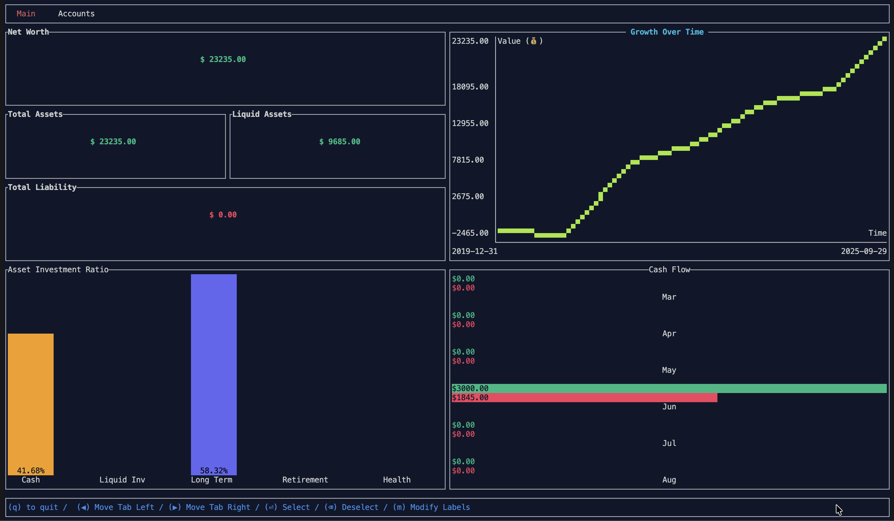
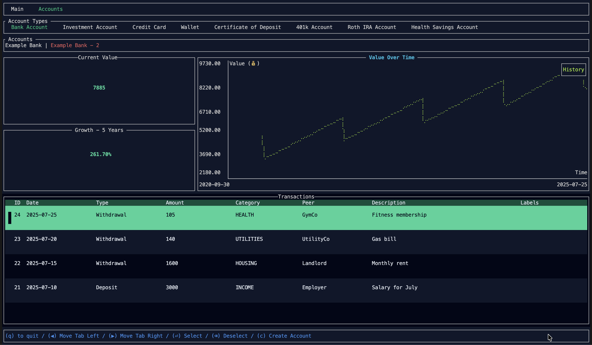
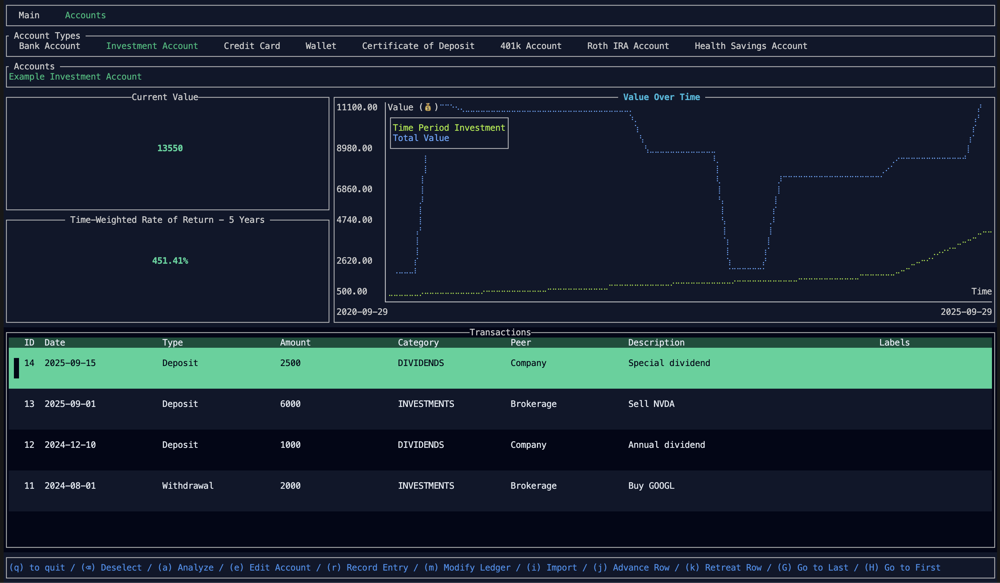

# FINTOOL

## Overview

FINTOOL is an application that allows a user, or users, to track their finances right from the comfort of their machine. It employs the use of a local SQLite database to track and store all required information: ranging from accounts; to transactions; stock purchases, sales and splits; and budgets. 

Provided that the data within the database is proactively maintained by the user, it maintains a near-accurate representation of a person's net worth. Using the Rust yahoo_finance_api crate, the applicaiton will retrieve all quote data for stocks owned for an account. 

Additionally, the application is knowledgeable of transfers between accounts. This means that only data entry is required per transaction to ensure that all impacted accounts immediately reflect the transaction of funds. 

At its core, the tool relies on a simple structure that defines all ledger transactions. This one structure allows the program to discern between a deposit and a withdrawal, the date of the transaction, the peer of the action, and the categorization of that action. This structure is extensible to include stock purchases and sales. With this definition, the program provides an easy-to-use interface that allows users to import comma-separate value (CSV) data for each account. In the same manner, the user can export data to a CSV file formatted in the same structure. 

__Prerequisites__
The system must have Rust cargo installed. 

__Supported Account Types__
| Account Type  | Description                                                                            | Supports Budget? | Identifiable Fund Limit |
| ------------- | -------------------------------------------------------------------------------------- | ---------------- | ----------------------- |
| Bank Account  | Implements a depository account for which a user can record deposits and withdrawals.  | Yes              | No                      |
| Wallet        | Implements a depository account for which a user can record deposits and withdrawals.  | Yes              | No                      |
| Credit Card   | Implements a depository account for which a user can record deposits and withdrawals.  | Yes              | Yes                     |
| Investment    | Implements a brokerage account comprised of a depository account for immediate transactions into and out of the account, in addition to stock purchases and sales that are made via account funds. | No | No |
| Health Savings Account    | Implements a brokerage account comprised of a depository account for immediate transactions into and out of the account, in addition to stock purchases and sales that are made via account funds. | No | Yes |
| ROTH IRA    | Implements a brokerage account comprised of a depository account for immediate transactions into and out of the account, in addition to stock purchases and sales that are made via account funds. | No | Yes |
| ROTH 401k    | Implements a brokerage account comprised of a depository account for immediate transactions into and out of the account, in addition to stock purchases and sales that are made via account funds. | No | Yes |

## User Interface

The application provides two pages:\
    * a main landing page, and,\
    * an accounts page. 

### Main Landing Page
The main landing page, provides a view into the user's net worth, total assets, total liabilities and growth over time. From the main landing page, a user can modify the labels associated with their account. Labels can be applied to recorded transactions.

### Accounts Page
The account page provides access to the several account types offered by the program. By selecting an account type (Enter), the program will allow the user to then cycle through each account for the selected account type. Selecting an account allows the user record transactions, modify the existing ledger, analyze growth and view account metrics. 

### Importing Data
Data can be imported using CSV files. Examples are provided with [`examples`](examples). The application will not accept headers but they are included as means to identify the expected format of the data. Furthermore, a series of utility application is provided with [`utils`]. These applications demonstrate how to translate a financial institution's proprietary format into the definition expected by the applicaiton. This structure is defined [`shared_lib::LedgerEntry`](shared_lib/src/lib.rs#L14-L24)

## Compiling the Source
The application is designed to support two methods of entry: a Tui-based applicaiton using the Ratatui crate and a terminal-based application. They can be built in the following ways 

| Application Type  | Command                                                                                |
| ----------------- | -------------------------------------------------------------------------------------- |
| Terminal          | `cargo build --release`                                                                |
| TUI               | `cargo build --release --features="ratatui_support"`                                   |

### For macOS
For the macOS envirionment, a [`build-macos-app.sh`](packaging/build-macos-app.sh) is provided to automatically compile the application for release within a macOS environment. 

## Author and Acknowledgements

